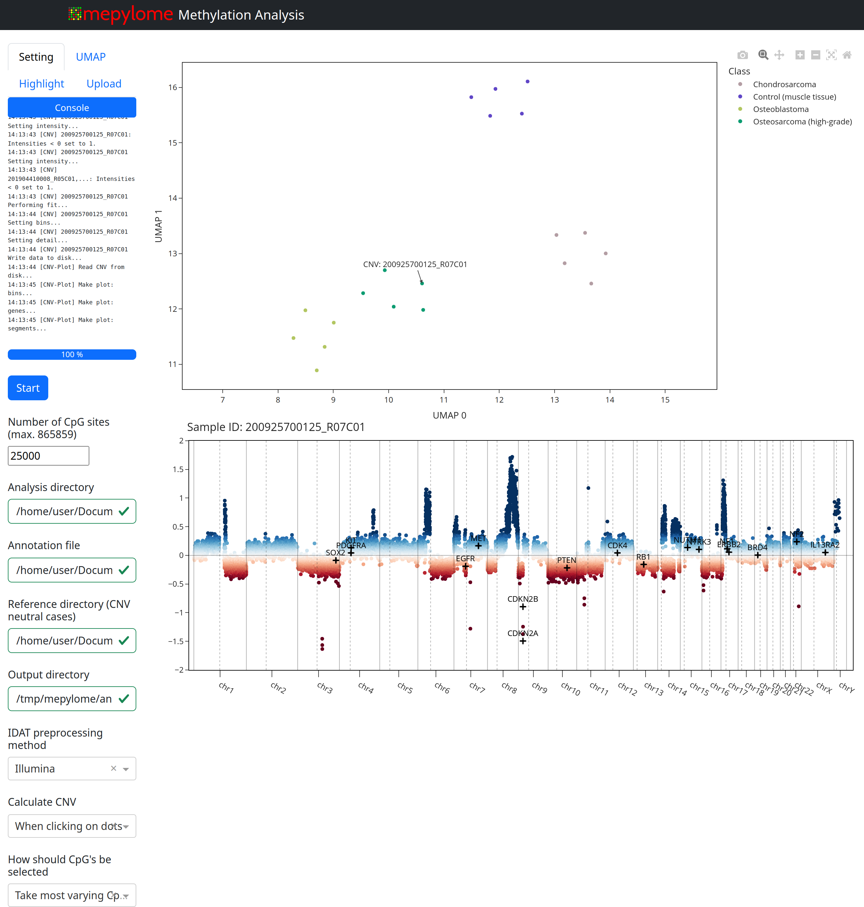

User Guide: CLI / GUI
=====================

This section will guide you through performing a methylation analysis using the
Mepylome command line interface (CLI) and graphical user interface (GUI).

.. contents:: Contents
   :depth: 3

Graphical user interface: Quick demonstration
---------------------------------------------

To perform a test methylation analysis, run the following command in the
terminal after installing mepylome (and optionally activating the corresponding
virtual environment). This command will download example IDAT files (to
`~/mepylome/` and launch the GUI. Note that the initial launch may
take some time:

.. code-block:: sh

    mepylome --tutorial

After pressing the start button, the beta values are extracted, and the UMAP
plot is generated. Clicking on a dot in the UMAP plot should display the
corresponding CNV at the bottom of the browser window. You should see something
similar to the following:

The GUI offers the following capabilities:

- Change directories (analysis, reference, annotation, output).
- Modify precalculation methods.
- Adjust CpG selection methods ('top', i.e. most variable, and 'random') and
  number of CpGs.
- Configure UMAP algorithm settings.
- Customize UMAP coloring based on columns provided in the annotation file.
- Highlight specific cases.
- Highlight genes in the CNV plot.
- Upload IDAT pairs for visualization in the plot upon rerunning.

.. _general_setup:

General setup
-------------

For methylation analysis, ensure you have an analysis directory containing the
IDAT files you wish to analyze, as well as a CNV-neutral reference set located
in another directory. Additionally, you will need an annotation file. This
spreadsheet should meet the following criteria: it must have a header, and the
first column should contain the Illumina Sentrix ID of the samples you want to
analyze. It can include additional columns with parameters specific to the
samples. In the GUI, you can later color the UMAP dots according to each
column in the annotation file. You can either place the annotation file within
the analysis directory, in which case mepylome will automatically detect it, or
you need to explicitly provide the file path during the initialization phase.

A possible data structure tree looks something like this:
.. TODO More details about annotation file. Other columns?

| **projects/**
|   **analysis_dir/**
|     200925700133_R02C01_Grn.idat
|     200925700133_R02C01_Red.idat
|     200925700133_R03C01_Grn.idat
|     200925700133_R03C01_Red.idat
|     200925700133_R04C01_Grn.idat
|     200925700133_R04C01_Red.idat
|     200925700133_R05C01_Grn.idat
|     200925700133_R05C01_Red.idat
|     annotation.csv
|   **reference_dir/**
|     201904410008_R02C01_Grn.idat
|     201904410008_R02C01_Red.idat
|     201904410008_R03C01_Grn.idat
|     201904410008_R03C01_Red.idat
|     201904410008_R04C01_Grn.idat
|     201904410008_R04C01_Red.idat
|     201904410008_R05C01_Grn.idat
|     201904410008_R05C01_Red.idat
|     201904410008_R06C01_Grn.idat
|     201904410008_R06C01_Red.idat

Both `analysis_dir` and `reference_dir` can contain IDAT files of various array
types and may include multiple subdirectories. Mepylome searches for all IDAT
files recursively.

The file `annotation.csv` has the following structure:

====================== ================ ===========
IDAT                    Diagnosis        Site
====================== ================ ===========
200925700133_R02C01     Osteosarcoma     Femur
200925700133_R03C01     Osteosarcoma     Humerus
200925700133_R04C01     Osteosarcoma     Femur
200925700133_R05C01     Osteosarcoma     femur
====================== ================ ===========

After completing the quick demonstration, you will have a valid setup in
`~/mepylome/tutorial/`.

Comand line interface
---------------------

To start mepylome from the command line without specifying any parameters:

.. code-block:: sh

    mepylome

To start mepylome with specific analysis and reference directories:

.. code-block:: sh

    mepylome -a ~/mepylome/tutorial/tutorial_analysis/ -r ~/mepylome/tutorial/tutorial_reference/

To see all available command-line parameters and options for mepylome, use the
help command:

.. code-block:: sh

    mepylome --help

Output data
~~~~~~~~~~~

The default **output directory** is `/tmp/mepylome`. You can change this using the
`\-\-output_dir` option. Please note that the output directory may grow in size
over time. If you encounter memory issues, you can safely delete the entire
directory or its subfolders.

Once downloaded and transformed, **manifest** files are saved under `~/.mepylome`.
